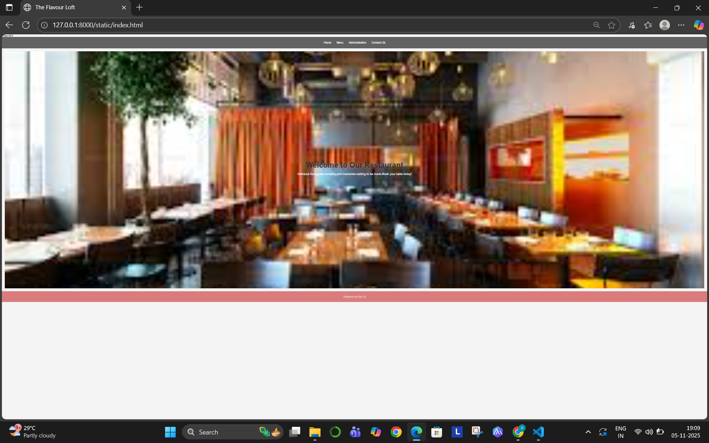
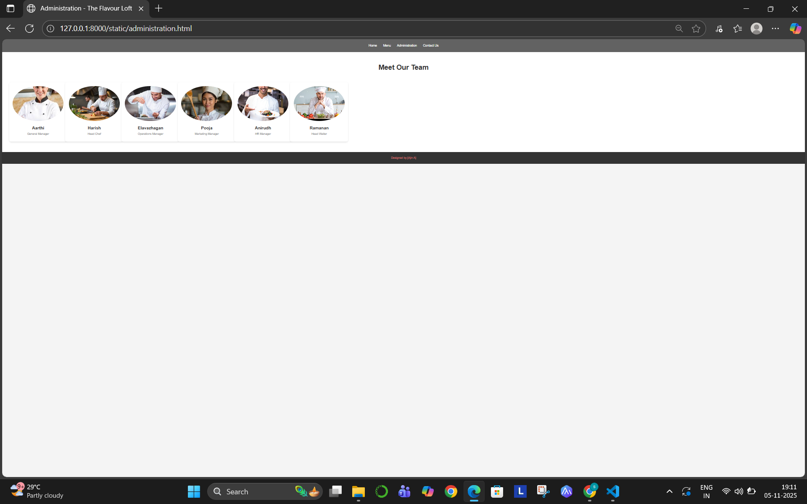
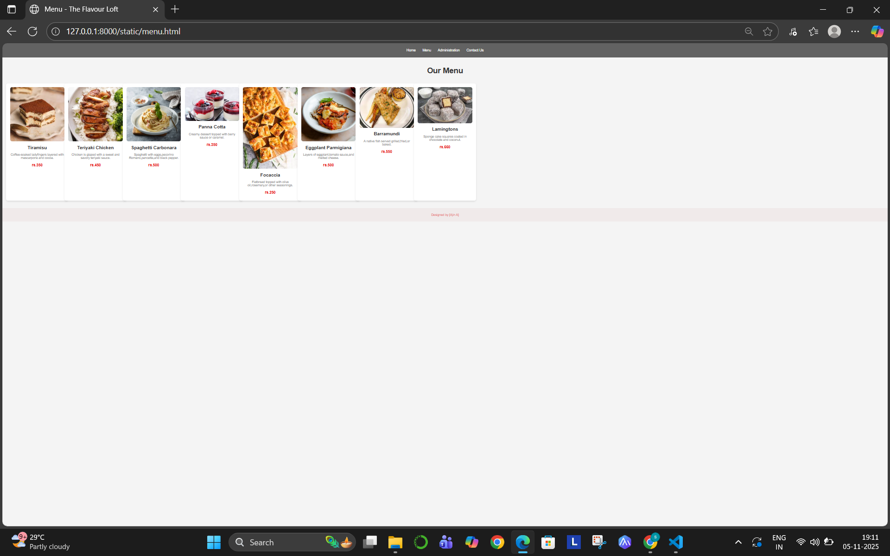

# Ex.07 Restuarant Website
## Date:5.11.2025

## AIM:
To develop a static Resturant website to display the menu and services provided by the resturant.

## DESIGN STEPS:

### Step 1:
Requirement collection.

### Step 2:
Creating the layout using HTML and CSS.

### Step 3:
Updating the sample content.

### Step 4:
Choose the appropriate style and color scheme.

### Step 5:
Validate the layout in various browsers.

### Step 6:
Validate the HTML code.

### Step 7:
Publish the website in the given URL.

## PROGRAM:
```
index.html
<!DOCTYPE html>
<html lang="en">
<head>
    <meta charset="UTF-8">
    <meta name="viewport" content="width=device-width, initial-scale=1.0">
    <title>The Flavour Loft</title>
    <link rel="stylesheet" href="styles.css">
</head>
<body>
    <header>
        <nav>
            <ul>
                <li><a href="index.html">Home</a></li>
                <li><a href="menu.html">Menu</a></li>
                <li><a href="administration.html">Administration</a></li>
                <li><a href="contact.html">Contact Us</a></li>
            </ul>
        </nav>
    </header>

    <section class="banner">
        <div class="banner-content">
            <h1>Welcome to Our Restaurant</h1>
            <p>Delicious food,great company,and memories waiting to be made.Book your table today!</p>
        </div>
    </section>

    <footer>
        <p>Designed by [Ajin A]</p>
    </footer>
</body>
</html>

administration.html
<!DOCTYPE html>
<html lang="en">
<head>
    <meta charset="UTF-8">
    <meta name="viewport" content="width=device-width, initial-scale=1.0">
    <title>Administration - The Flavour Loft</title>
    <link rel="stylesheet" href="sty.css">
</head>
<body>
    <header>
        <nav>
            <ul>
                <li><a href="index.html">Home</a></li>
                <li><a href="menu.html">Menu</a></li>
                <li><a href="administration.html">Administration</a></li>
                <li><a href="contact.html">Contact Us</a></li>
            </ul>
        </nav>
    </header>

    <section class="administration">
        <h1>Meet Our Team</h1>
        <div class="team-grid">
            <div class="team-member">
                
                <h2>Aarthi</h2>
                <p>General Manager</p>
            </div>
            <div class="team-member">
                
                <h2>Harish</h2>
                <p>Head Chef</p>
            </div>
            <div class="team-member">
                
                <h2>Elavazhagan</h2>
                <p>Operations Manager</p>
            </div>
            <div class="team-member">
                
                <h2>Pooja</h2>
                <p>Marketing Manager</p>
            </div>
            <div class="team-member">
                
                <h2>Anirudh</h2>
                <p>HR Manager</p>
            </div>
            <div class="team-member">
                
                <h2>Ramanan</h2>
                <p>Head Waiter</p>
            </div>
        </div>
    </section>

    <footer>
        <p>Designed by [Ajin A]</p>
    </footer>
</body>
</html>

menu.html
<!DOCTYPE html>
<html lang="en">
<head>
    <meta charset="UTF-8">
    <meta name="viewport" content="width=device-width, initial-scale=1.0">
    <title>Menu - The Flavour Loft</title>
    <link rel="stylesheet" href="styless.css">
</head>
<body>
    <header>
        <nav>
            <ul>
                <li><a href="index.html">Home</a></li>
                <li><a href="menu.html">Menu</a></li>
                <li><a href="administration.html">Administration</a></li>
                <li><a href="contact.html">Contact Us</a></li>
            </ul>
        </nav>
    </header>

    <section class="menu">
        <h1>Our Menu</h1>
        <div class="menu-grid">
            <div class="menu-item">
                
                <h2>Tiramisu</h2>
                <p>Coffee-soaked ladyfingers layered with mascarpone and cocoa.</p>
                <p class="price">rs.350</p>
            </div>
            <div class="menu-item">
            
                <h2>Teriyaki Chicken</h2>
                <p>Chicken is glazed with a sweet and savory teriyaki sauce.</p>
                <p class="price">rs.450</p>
            </div>
            <div class="menu-item">
                
                <h2>Spaghetti Carbonara</h2>
                <p>Spaghetti with eggs,pecorino Romano,pancetta,and black pepper.</p>
                <p class="price">rs.500</p>
            </div>
            <div class="menu-item">
                
                <h2>Panna Cotta</h2>
                <p>Creamy dessert topped with berry sauce or caramel.</p>
                <p class="price">rs.350</p>
            </div>
            <div class="menu-item">
                
                <h2>Focaccia</h2>
                <p>Flatbread topped with olive oil,rosemary,or other seasonings.</p>
                <p class="price">rs.250</p>
            </div>
            <div class="menu-item">
                
                <h2>Eggplant Parmigiana</h2>
                <p>Layers of eggplant,tomato sauce,and melted cheese.</p>
                <p class="price">rs.500</p>
            </div>
        <div class="menu-item">
            
            <h2>Barramundi</h2>
            <p>A native fish served grilled,fried,or baked.</p>
            <p class="price">rs.550</p>
        </div>
        <div class="menu-item">
            
            <h2>Lamingtons</h2>
            <p>Sponge cake squares coated in chocolate and coconut.</p>
            <p class="price">rs.660</p>
        </div>
    </section>

    <footer>
        <p>Designed by [Ajin A]</p>
    </footer>
</body>
</html>

contact.html
<!DOCTYPE html>
<html lang="en">
<head>
    <meta charset="UTF-8">
    <meta name="viewport" content="width=device-width, initial-scale=1.0">
    <title>Contact Us - The Flavour Loft</title>
    <link rel="stylesheet" href="st.css">
</head>
<body>
    <header>
        <nav>
            <ul>
                <li><a href="index.html">Home</a></li>
                <li><a href="menu.html">Menu</a></li>
                <li><a href="administration.html">Administration</a></li>
                <li><a href="contact.html">Contact Us</a></li>
            </ul>
        </nav>
    </header>

    <section class="contact">
        <h1>Contact Us</h1>
        <p>Address: 123 Restaurant St., City, Country</p>
        <p>Phone: +123 456 7890</p>
        <p>Email: contact@restaurant.com</p>
    </section>

    <footer>
        <p>Designed by [Ajin A]</p>
    </footer>
</body>
</html>
```


## OUTPUT:





## RESULT:
The program for designing software company website using HTML and CSS is completed successfully.
